<!-- ════════════════════════════ HERO ════════════════════════════ -->
<div align="center">



<br/><br/>


<br/>

<a href="https://Ahm4dA.github.io">
  
</a>
<a href="https://www.linkedin.com/in/muhammad-ahmad-adnan-a092ab228/">
  
</a>
<a href="mailto:ahmadadnan2003aaa@gmail.com">
  
</a>

<br/><br/>


</div>


<!-- ════════════════════════════ ABOUT ════════════════════════════ -->
## <samp>&gt; whoami</samp>

```python
class MuhammadAhmadAdnan:
    """Software Engineer · AI/ML Developer"""

    def __init__(self):
        self.education   = "BS Software Engineering @ FAST-NUCES"
        self.specialties = ["NLP", "Data Pipelines", "Full-Stack Systems"]

    def current_focus(self) -> dict:
        return {
            "building":   "AI chatbots & voice assistants on cloud infrastructure ☁️",
            "training":   "Fine-tuned BERT models for dialogue-based NLP 🧠",
            "shipping":   "Production apps with Next.js, TypeScript & the MERN stack 🚀",
            "automating": "QA pipelines with Selenium & Cypress ✅",
        }

    def philosophy(self) -> str:
        return "research notebook ──▶ deployed, production-grade system"
```


<!-- ════════════════════════════ TECH STACK ════════════════════════════ -->
## <samp>&gt; tech_stack --list</samp>

<div align="center">

**🧠 AI / Machine Learning**


    

**⚙️ Languages**


**🎨 Frontend &nbsp;·&nbsp; 🔧 Backend**


**🗄️ Data &nbsp;·&nbsp; ☁️ Cloud & DevOps**


**✅ Testing & QA**


 

</div>


<!-- ════════════════════════════ PROJECTS ════════════════════════════ -->
## <samp>&gt; featured_projects</samp>

<div align="center">

<a href="https://github.com/Ahm4dA/aqi_predictor">
  
</a>
<a href="https://github.com/Ahm4dA/trading-ai">
  
</a>

<a href="https://github.com/Ahm4dA/Numeric-identification">
  
</a>
<a href="https://github.com/Ahm4dA/Point_of_Sale">
  
</a>

<a href="https://github.com/Ahm4dA/We-are-F1">
  
</a>
<a href="https://github.com/Ahm4dA/Ahm4dA.github.io">
  
</a>

</div>

| Project | What it does | Stack |
|---|---|---|
| 🌫️ **[aqi_predictor](https://github.com/Ahm4dA/aqi_predictor)** | Air Quality Index forecasting with time-series models | `Python` `TensorFlow` `LSTM` |
| 📈 **[trading-ai](https://github.com/Ahm4dA/trading-ai)** | AI trading research pipeline with multi-timeframe feature engineering | `Python` `Docker` `PostgreSQL` |
| ✍️ **[Numeric-identification](https://github.com/Ahm4dA/Numeric-identification)** | Handwritten digit recognition with an interactive drawing canvas | `Python` `ML` |
| 🧾 **[Point_of_Sale](https://github.com/Ahm4dA/Point_of_Sale)** | Bakery point-of-sale system | `C#` `.NET` |


<!-- ════════════════════════════ STATS ════════════════════════════ -->
## <samp>&gt; github_analytics</samp>

<div align="center">


<br/><br/>


<br/><br/>


<br/><br/>

<!-- 🐍 Generated by the "Generate Contribution Snake" GitHub Action — see SETUP.md -->
<picture>
  <source media="(prefers-color-scheme: dark)" srcset="https://raw.githubusercontent.com/Ahm4dA/Ahm4dA/output/snake.svg" />
  <source media="(prefers-color-scheme: light)" srcset="https://raw.githubusercontent.com/Ahm4dA/Ahm4dA/output/snake-light.svg" />
  
</picture>

<br/><br/>

<details>
  <summary><b>🏆 Trophy cabinet</b></summary>
  <br/>
  
</details>

</div>


<!-- ════════════════════════════ EXPERIENCE ════════════════════════════ -->
## <samp>&gt; experience --highlights</samp>

- 🗣️ **Conversational AI** — built AI chatbot & voice-bot systems running on cloud infrastructure
- 📊 **ML in production** — developed pipelines for admissions prediction and healthcare computer vision
- 🔤 **NLP engineering** — fine-tuned BERT models for dialogue-based language tasks
- ✅ **Quality at scale** — implemented QA automation frameworks with Selenium & Cypress
- 👥 **Leadership** — led a team customizing HR & payroll systems serving **1,200+ users**


<!-- ════════════════════════════ CONNECT ════════════════════════════ -->
## <samp>&gt; connect --with-me</samp>

<div align="center">

<a href="https://www.linkedin.com/in/muhammad-ahmad-adnan-a092ab228/">
  
</a>
&nbsp;
<a href="mailto:ahmadadnan2003aaa@gmail.com">
  
</a>
&nbsp;
<a href="https://Ahm4dA.github.io">
  
</a>

<br/><br/>


</div>
